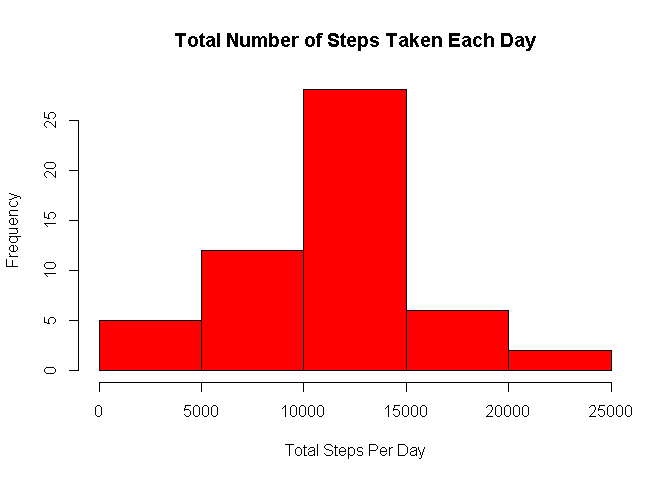
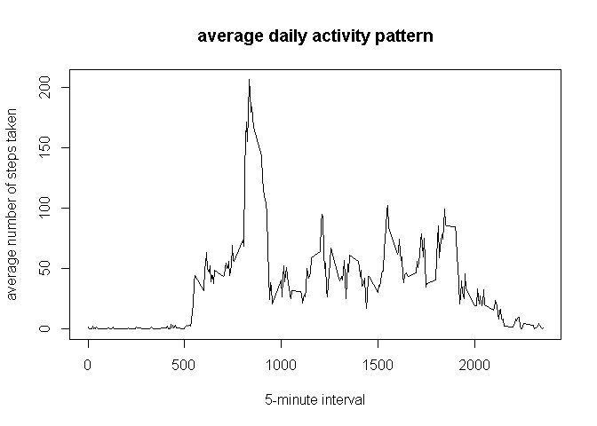
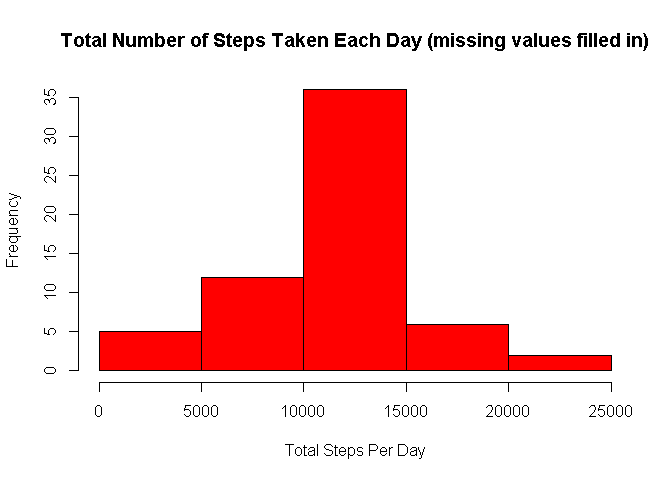
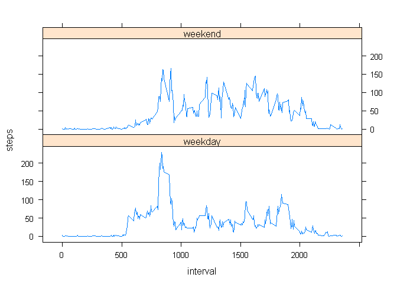

# Reproducible Research: Peer Assessment 1

## Loading and preprocessing the data
Clean workspace & Set working directory

```r
rm(list=ls())
setwd("E:/R/05 Reproducible Research/Project 1")
getwd()
```

```
## [1] "E:/R/05 Reproducible Research/Project 1"
```

Load data

```r
datafile <- "./activity/activity.csv"
data <- read.csv(datafile)
dim(data)
```

```
## [1] 17568     3
```

```r
head(data)
```

```
##   steps       date interval
## 1    NA 2012-10-01        0
## 2    NA 2012-10-01        5
## 3    NA 2012-10-01       10
## 4    NA 2012-10-01       15
## 5    NA 2012-10-01       20
## 6    NA 2012-10-01       25
```

Convert date column into "date" format

```r
data$date <- as.Date(data$date, "%Y-%m-%d")
```

## What is mean total number of steps taken per day?
Ignore missing values

```r
data.noNA <- data[!is.na(data$steps),]
```

Calculate Steps Per Day

```r
steps.day <- tapply(data.noNA$steps, data.noNA$date, sum)
```

Create Histogram of the Total Number of Steps Taken Each Day

```r
hist(steps.day, col="red", main="Total Number of Steps Taken Each Day", xlab="Total Steps Per Day")
```

 

Calculate mean and median of the total number of steps taken per day

```r
mean.steps.day <- round(mean(steps.day),1)
mean.steps.day
```

```
## [1] 10766.2
```

```r
median.steps.day <- median(steps.day)
median.steps.day
```

```
## [1] 10765
```
**The mean steps per day is 10766.2.**  
**The median steps per day is 10765.**  

## What is the average daily activity pattern?
Calculate mean for each 5 minute interval using tapply function.

```r
steps.interval <- tapply(data.noNA$steps, data.noNA$interval, mean)
interval <- names(steps.interval)
plot(interval,steps.interval,type = "l",main="average daily activity pattern",xlab="5-minute interval",ylab="average number of steps taken")
```

 

```r
max.interval <- names(steps.interval[which(steps.interval == max(steps.interval))])
max.interval
```

```
## [1] "835"
```

```r
max.steps <- max(steps.interval)
max.steps
```

```
## [1] 206.1698
```
**The 835th interval contains the on average maximum number of steps (206.2) in a day.**

## Imputing missing values
Total number of missing values (rows)

```r
num.missing <- sum(is.na(data$steps))
num.missing
```

```
## [1] 2304
```
**The total number of missing values in the dataset is 2304**

Fill in the missing values of steps with the average for the corresponding 5-minute interval.  

```r
data.NA <- data[is.na(data$steps),]
data.NA$steps <- steps.interval[as.character(data.NA$interval)]
data.new <- rbind(data.noNA, data.NA)
```

Calculate Steps Per Day on new dataset

```r
steps.day.new <- tapply(data.new$steps, data.new$date, sum)
```

Create Histogram of the Total Number of Steps Taken Each Day

```r
hist(steps.day.new, col="red", main="Total Number of Steps Taken Each Day (missing values filled in)", xlab="Total Steps Per Day")
```

 

Calculate mean and median of the total number of steps taken per day

```r
mean.steps.day.new <- round(mean(steps.day.new),1)
mean.steps.day.new
```

```
## [1] 10766.2
```

```r
median.steps.day.new <- round(median(steps.day.new),1)
median.steps.day.new
```

```
## [1] 10766.2
```
**The mean after inputing missing values is 10766.2**  
**The median after inputing missing values is 10766.2**  
**The mean is the same as before and the median changed by less than two steps.**  
**This is expected since we replaced the missing values with the mean from all days for that 5 min interval.**

## Are there differences in activity patterns between weekdays and weekends?

Add new factor variables weekday & typeday

```r
data.new$weekday <- weekdays(data.new$date)
data.new$typeday <- "weekday"
data.new$typeday[data.new$weekday %in% c('Saturday','Sunday')] <- "weekend"
```

Aggregate over 5 min interval & type of day.  
Create double plot using lattice system.

```r
data.aggregate <- aggregate(x=data.new$steps,
                            by=list(interval=data.new$interval,typeday=data.new$typeday),
                            FUN=mean)
colnames(data.aggregate)[3] <- "steps"

library(lattice)
xyplot(steps ~ interval | typeday, data = data.aggregate, layout = c(1, 2), type = "l")
```

 

**From the plot there appears to be more steps taken during the day on weekends than weekdays.**

